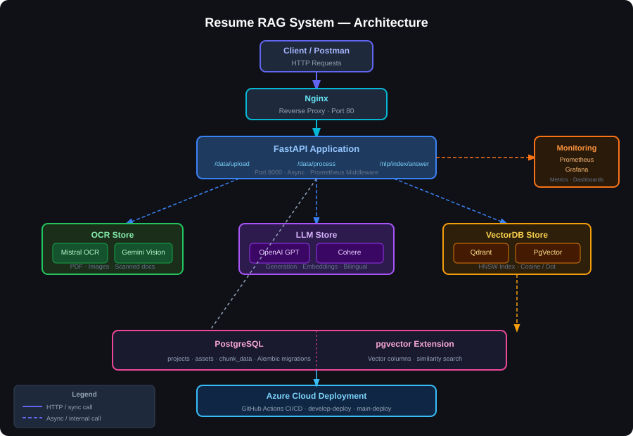

# 🤖 Resume RAG System

> An intelligent, production-grade Retrieval-Augmented Generation (RAG) API that answers questions about my resume and CV — powered by multiple LLM providers, dual vector databases, OCR pipelines, and deployed on Azure with full observability.

---

##  Overview

This system ingests PDF and text documents (resume, CV, portfolio) and exposes a conversational Q&A API. Recruiters or anyone interested can query it in **English or Arabic** and receive contextually accurate answers grounded in the source documents.

**Core pipeline:**
```
PDF/TXT Upload → OCR + Text Extraction → Chunking → Embedding → Vector DB
                                                                      ↓
                                                   Query → Embed → Similarity Search → LLM → Answer
```

---

##  Architecture



---

##  Key Features

| Feature | Details |
|---|---|
| **Multi-LLM Support** | OpenAI GPT + Cohere — switchable via environment config |
| **Dual Vector DB** | Qdrant (local/embedded) or PgVector (PostgreSQL) — provider-agnostic interface |
| **OCR Pipeline** | Mistral OCR + Google Gemini — handles scanned PDFs and images |
| **Bilingual** | Prompt templates in English 🇬🇧 and Arabic 🇸🇦 with auto language detection |
| **Production Observability** | Prometheus metrics + Grafana dashboards for request counts, latency, DB stats |
| **Azure Deployment** | CI/CD via GitHub Actions with separate `develop` and `main` pipelines |
| **Database Migrations** | Alembic-managed PostgreSQL schema with full version history |
| **Async Throughout** | Full async FastAPI + SQLAlchemy + asyncpg stack for high concurrency |

---

##  Tech Stack

**Backend**
- [FastAPI](https://fastapi.tiangolo.com/) — async REST API framework
- [SQLAlchemy 2.0](https://www.sqlalchemy.org/) + [asyncpg](https://github.com/MagicStack/asyncpg) — async PostgreSQL ORM
- [Alembic](https://alembic.sqlalchemy.org/) — database migrations
- [LangChain](https://python.langchain.com/) — text splitting utilities

**AI / ML**
- [OpenAI API](https://platform.openai.com/) — GPT generation + embeddings
- [Cohere API](https://cohere.com/) — generation + embeddings with RAG-native document support
- [Mistral OCR](https://mistral.ai/) — document OCR
- [Google Gemini](https://ai.google.dev/) — vision-based OCR

**Vector Databases**
- [Qdrant](https://qdrant.tech/) — lightweight embedded vector store
- [PgVector](https://github.com/pgvector/pgvector) — PostgreSQL vector extension with HNSW indexing

**Infrastructure**
- [Docker Compose](https://docs.docker.com/compose/) — full local environment
- [Nginx](https://nginx.org/) — reverse proxy
- [Prometheus](https://prometheus.io/) + [Grafana](https://grafana.com/) — monitoring
- [Azure](https://azure.microsoft.com/) — cloud deployment target
- [GitHub Actions](https://github.com/features/actions) — CI/CD pipelines

---

##  Quick Start

### Prerequisites

- Python 3.10+
- Docker & Docker Compose
- API keys for at least one LLM provider (OpenAI or Cohere) and one OCR provider (Mistral or Gemini)

### 1. Clone & Configure

```bash
git clone https://github.com/MohamedEhab155/RAG-System
cd RAG-System
```

```bash
# App environment
cp Src/.env.example Src/.env
# Edit Src/.env with your API keys (see Environment Variables below)
```

### 2. Start Services with Docker

```bash
cd docker

# Copy and configure each env file
cp env/.env.examble_app        env/.env.app
cp env/.env.examble.postgres   env/.env.postgres
cp env/.env.examble.grafana    env/.env.grafana

# Start all services
sudo docker compose up -d
```

Or start only core services (no monitoring):

```bash
docker compose up -d fastapi nginx pgvector qdrant
```

### 3. Run the API (Local Development)

```bash
cd Src
pip install -r requirements.txt
uvicorn main:app --reload --host 0.0.0.0 --port 5000
```

API docs available at: **http://localhost:5000/docs**


---

## Environment Variables

Key variables in `Src/.env`:

```env
# App
APP_NAME=mini-rag
APP_VERSION=1.0.0

# LLM Providers (pick one or both)
GENERATION_BACKEND=COHERE        # OPENAI or COHERE
EMBEDDING_BACKEND=COHERE         # OPENAI or COHERE
OPENAI_API_KEY=sk-...
COHERE_API_KEY=...

# Model Config
GENERATION_MODEL_ID=command-r-plus
EMBEDDING_MODEL_ID=embed-multilingual-v3.0
EMBEDDING_MODEL_SIZE=1024

# Vector DB
VECTOR_DB_BACKEND=PGVECTOR       # QDRANT or PGVECTOR
VECTOR_DB_DISTANCE_METHOD=cosine

# OCR
OCR_BACKEND=MISTRAL              # MISTRAL or GEMENAI
MISTRAL_API_KEY=...
GEMENAI_API_KEY=...

# PostgreSQL
POSTGRES_USERNAME=...
POSTGRES_PASSWORD=...
POSTGRES_HOST=pgvector
POSTGRES_PORT=5432
POSTGRES_MAIN_DATABASE=minirag

# Language
PRIMARY_LANG=en                  # en or ar
```

---

##  API Reference

### Data Endpoints

| Method | Endpoint | Description |
|---|---|---|
| `POST` | `/app/v2/data/upload/{project_id}` | Upload a PDF or TXT document |
| `POST` | `/app/v2/data/process/{project_id}` | Chunk and store document content |

### NLP / RAG Endpoints

| Method | Endpoint | Description |
|---|---|---|
| `POST` | `/app/v2/nlp/index/push/{project_id}` | Embed chunks and push to vector DB |
| `GET` | `/app/v2/nlp/index/info/{project_id}` | Get vector collection metadata |
| `POST` | `/app/v2/nlp/index/search/{project_id}` | Semantic similarity search |
| `POST` | `/app/v2/nlp/index/answer/{project_id}` | Full RAG answer generation |

### RAG DEMO 

```bash
```


---


---

##  Monitoring

Access the observability stack after running Docker Compose:

| Service | URL | Default Credentials |
|---|---|---|
| **API Docs** | http://localhost:8000/docs | — |
| **Grafana** | http://localhost:3000 | admin / see `.env.grafana` |
| **Prometheus** | http://localhost:9090 | — |
| **Qdrant UI** | http://localhost:6333/dashboard | — |

### Recommended Grafana Dashboards

- [FastAPI Observability](https://grafana.com/grafana/dashboards/18739) — request rates, latency, error rates
- [Node Exporter Full](https://grafana.com/grafana/dashboards/1860) — system metrics
- [PostgreSQL Exporter](https://grafana.com/grafana/dashboards/12485) — DB performance
- [Qdrant](https://grafana.com/grafana/dashboards/23033) — vector DB stats


---

##  Azure Deployment

The project includes GitHub Actions workflows for automated deployment:

- **`develop-deploy.yml`** — triggered on pushes to the `develop` branch
- **`main-deploy.yml`** — triggered on pushes to `main` (production)

---

##  Database Migrations

Migrations are managed with Alembic. The schema includes three tables: `projects`, `assets`, and `chunk_data`.

```bash
cd Src/models/db_Schema/rag

# Apply all migrations
alembic upgrade head

# Create a new migration (after model changes)
alembic revision --autogenerate -m "describe change"

# Rollback one step
alembic downgrade -1
```

---

## 📁 Project Structure

```
├── Src/
│   ├── main.py                  # FastAPI app entry point
│   ├── Contoroller/             # Business logic layer
│   │   ├── NLPContoroller.py    # RAG pipeline orchestration
│   │   ├── ProcessContoroller.py# Document chunking
│   │   └── DataContoroller.py   # File validation & storage
│   ├── Stores/
│   │   ├── LLM/                 # OpenAI + Cohere providers
│   │   ├── VectorDB/            # Qdrant + PgVector providers
│   │   └── OCR/                 # Mistral + Gemini providers
│   ├── models/
│   │   ├── db_Schema/           # SQLAlchemy models + Alembic
│   │   └── Enums/               # Response signals, processing types
│   ├── Routers/                 # FastAPI route definitions
│   └── utils/
│       ├── PDFLoader.py         # Parallel OCR PDF processor
│       ├── CleanText.py         # Arabic/English text cleaner
│       └── metrics.py           # Prometheus middleware
└── docker/
    ├── docker-compose.yml
    ├── nginx/
    └── Prometheus/
```

---

## 👤 Author

**Mohamed Ehab**
- GitHub: [@MohamedEhab155](https://github.com/MohamedEhab155)

---

## 📄 License

This project is licensed under the terms in the [LICENSE](./LICENSE) file.